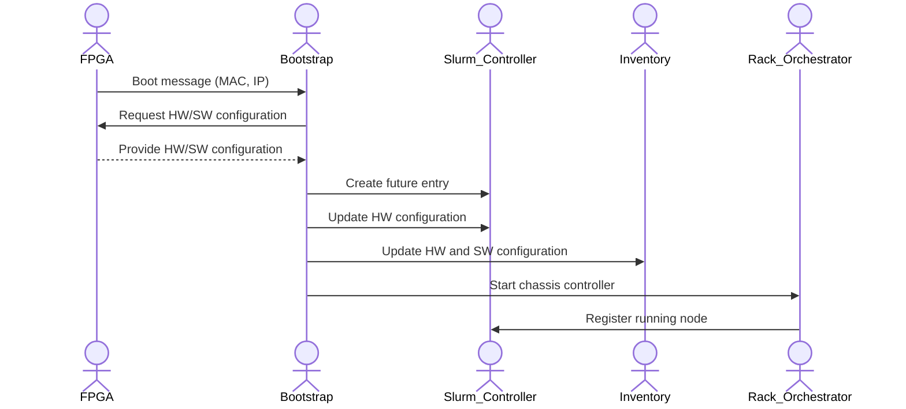

Testing viewing a Mermaid diagram in Markdown:

```mermaid
sequenceDiagram
    actor FPGA
    actor Bootstrap
    actor Slurm_Controller
    actor Inventory
    actor Rack_Orchestrator

    FPGA->>Bootstrap: Boot message (MAC, IP)
    Bootstrap->>FPGA: Request HW/SW configuration
    FPGA-->>Bootstrap: Provide HW/SW configuration
    Bootstrap->>Slurm_Controller: Create future entry
    Bootstrap->>Slurm_Controller: Update HW configuration
    Bootstrap->>Inventory: Update HW and SW configuration
    Bootstrap->>Rack_Orchestrator: Start chassis controller
    Rack_Orchestrator->>Slurm_Controller: Register running node
```
